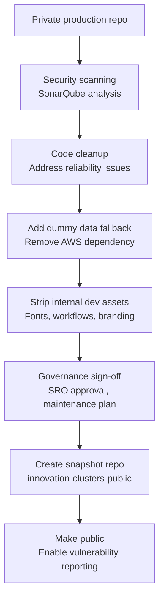

When we started building the [Innovation Clusters map](https://www.innovationclusters.dsit.gov.uk/) in 2025, open sourcing the code was baked into the plan. ONS had open sourced their [census maps implementation](https://github.com/ONSdigital/dp-census-atlas/tree/dbd9b7cef5d0f38dfbae9a7096e5b3de041e4c09), and that code became a crucial reference point for us. We were building from scratch, but having their Svelte and set-up available meant we could see how decisions had been made, understand trade-offs, and avoid reinventing wheels. When the map was published (and [highly commended in the Analysis in Government awards](https://analysisfunction.civilservice.gov.uk/news/winners-of-the-sixth-aig-awards/#communication-award-highly-commended-department-for-science-innovation-and-technology-dsit-)), it was right to pay that forward.

This said, there is a gap between "we should open source this" and actually clicking the button to make a repo public. Here, that gap was about ten months of background work (if we’re including our default code review processes), navigating technical assurance, governance processes, and design decisions about what "open source" actually meant for this project. The version we landed on was a clean snapshot repository: the frontend only, stripped of dev tooling, runnable without internal infrastructure. Here's what that journey looked like.

_The process to open source_

## Making it runnable everywhere

The first major decision was usability. Our production app pulls institution data from AWS S3—which is fine internally, but expecting external users to configure AWS credentials just to *see* the map locally would create unnecessary friction. We wanted anyone to be able to run two setup commands (`npm install`, `npm run dev`) and have a working map in their browser.
The solution was a fallback mechanism: if the app can't detect or fetch from AWS, it falls back to a local `dummy_data` directory. This followed our team's best practice guidance for open-source releases. The dummy data is structured identically to production data, so it populates the map with examples that demonstrate how everything works without requiring familiarity with AWS. That meant external developers could start experimenting immediately, then swap in their own data sources when ready.

## Assurance
Government code release involves more than checking "make repo public" on GitHub. Open-sourcing code is a learning curve in our team; for this project, we followed an internal technical assurance checklist (based on [GDS guidance](https://www.gov.uk/service-manual/technology/making-source-code-open-and-reusable)), which included making sure we had run security scans and addressed findings before release. We used [SonarQube Community Build](https://www.sonarsource.com/open-source-editions/sonarqube-community-edition/) to analyse the codebase, and we'd been doing thorough peer review and Copilot checks on every PR throughout development, alongside collaborating with security and architecture specialists.

The SonarQube scan flagged small reliability improvements, and we also updated dependencies flagged by Dependabot and removed legacy Python files that were no longer part of the codebase. None of this was urgent - just incremental polish to ensure what we released met expected standards.

The public repo is not under active development - the app is feature-complete and under code freeze - but we still needed a clear stance on how we'd handle external engagement. The README gives clear guidance, stating that we'll monitor issues and welcome PRs flagging bugs or improvements, but we can't guarantee responses and won't be merging contributions. If someone finds a security vulnerability, they can report it privately via GitHub's vulnerability reporting feature (which we enabled on launch day). Questions about the app itself should go to the [innovation clusters team email](mailto:innovationclusters@dsit.gov.uk), not GitHub issues. For us, this strikes the right balance to sustainably engage with feedback. 

## The cycle continues

Since going public in mid-February, the repo has collected 16 stars and 3 forks. More meaningfully, we've had positive feedback from other government departments and researchers who are using the code as a starting point for their own geospatial projects. The goal of enabling deduplication and giving others a head start on similar work has been achieved. Though we'll likely refine exactly how we open source going forward, the code is out there now, and if it saves someone else from solving problems we've already solved, that's a worthwhile outcome.

*The public code is available at [github.com/dsit-data-science/innovation-clusters-public](https://github.com/dsit-data-science/innovation-clusters-public).*

